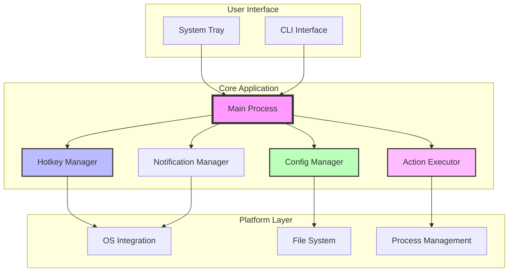
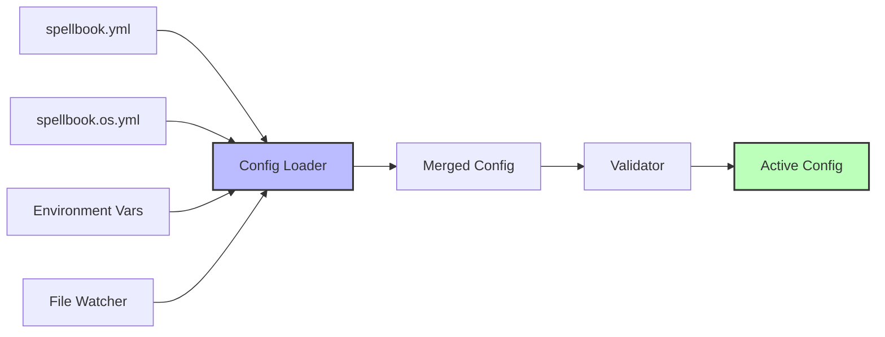
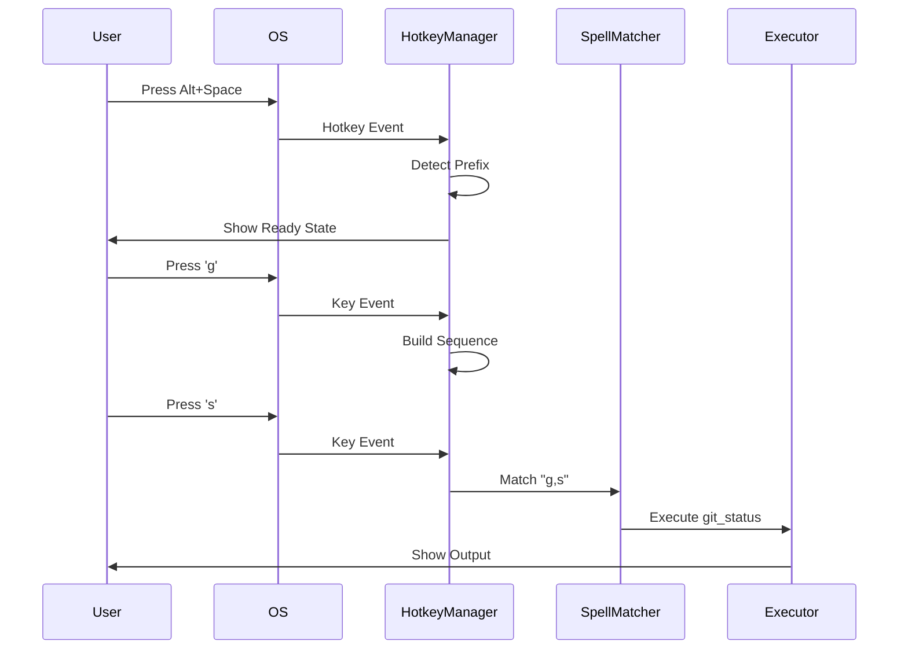
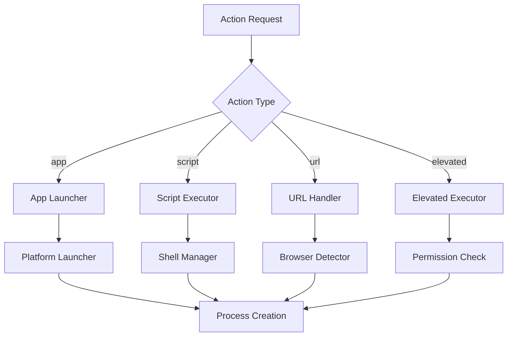
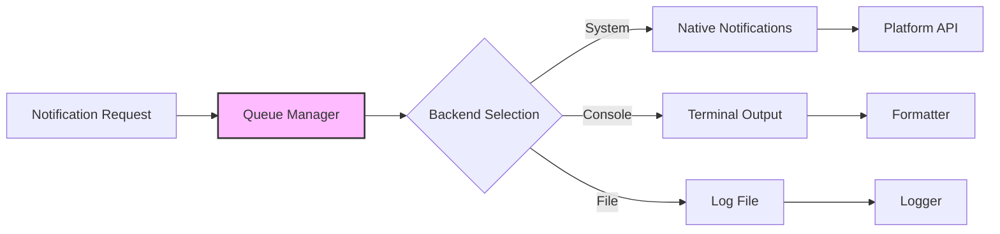
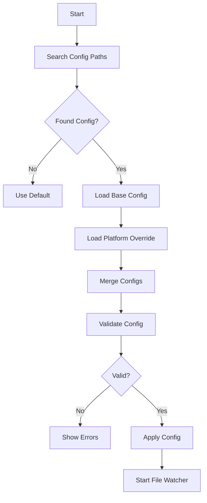
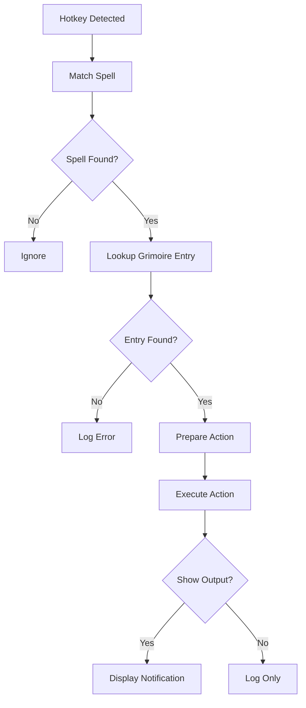
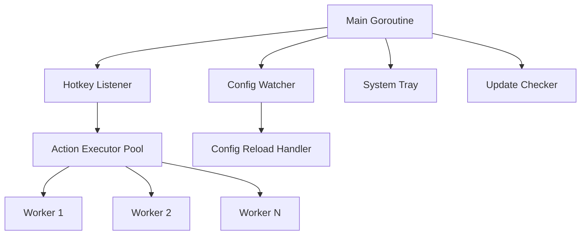

# Architecture Overview

This document provides a comprehensive overview of SilentCast's internal architecture, design decisions, and implementation patterns.

## 🎯 High-Level Architecture

SilentCast follows a modular, event-driven architecture with clear separation of concerns:



## 📁 Project Structure

```
SilentCast/
├── app/                           # Application source code
│   ├── cmd/silentcast/            # Main entry point
│   │   └── main.go                # Application bootstrap
│   │
│   ├── internal/                  # Private packages (not importable)
│   │   ├── action/                # Action execution system
│   │   │   ├── app/               # Application launcher
│   │   │   ├── browser/           # Browser URL handler
│   │   │   ├── launcher/          # Platform launchers
│   │   │   ├── script/            # Script execution
│   │   │   ├── shell/             # Shell management
│   │   │   ├── url/               # URL handling
│   │   │   ├── executor.go        # Main executor
│   │   │   └── elevated.go        # Elevated permissions
│   │   │
│   │   ├── config/                # Configuration management
│   │   │   ├── loader.go          # Config loading logic
│   │   │   ├── types.go           # Config structures
│   │   │   ├── validator.go       # Validation logic
│   │   │   └── watcher.go         # File watching
│   │   │
│   │   ├── hotkey/                # Hotkey detection
│   │   │   ├── manager.go         # Hotkey management
│   │   │   ├── manager_stub.go    # No-op implementation
│   │   │   ├── keymapper_*.go    # Platform key mapping
│   │   │   └── parser.go          # Key string parsing
│   │   │
│   │   ├── notify/                # Notification system
│   │   │   ├── interface.go       # Notifier interface
│   │   │   ├── console.go         # Console output
│   │   │   ├── system_*.go        # Platform notifications
│   │   │   └── queue.go           # Notification queuing
│   │   │
│   │   ├── output/                # Output management
│   │   │   ├── interface.go       # Output interfaces
│   │   │   ├── buffered.go        # Buffered output
│   │   │   ├── streaming.go       # Streaming output
│   │   │   └── formatter.go       # Output formatting
│   │   │
│   │   ├── permission/            # Permission management
│   │   │   ├── interface.go       # Permission interface
│   │   │   ├── manager_*.go       # Platform managers
│   │   │   └── types.go           # Permission types
│   │   │
│   │   ├── tray/                  # System tray
│   │   │   ├── tray.go            # Tray management
│   │   │   ├── menu.go            # Menu construction
│   │   │   └── icon_*.go          # Platform icons
│   │   │
│   │   └── updater/               # Auto-update system
│   │       ├── updater.go         # Update logic
│   │       ├── checksum.go        # File verification
│   │       └── progress.go        # Download progress
│   │
│   └── pkg/                       # Public packages
│       └── logger/                # Logging utilities
│           ├── logger.go          # Logger implementation
│           └── config.go          # Logger configuration
│
├── docs/                          # Documentation
├── examples/                      # Example configurations
└── .ticket/                       # Development tickets
```

## 🏗️ Core Components

### Main Process

The main process orchestrates all components and manages the application lifecycle:

```go
// cmd/silentcast/main.go
func main() {
    // 1. Parse CLI arguments
    args := parseArgs()
    
    // 2. Initialize logger
    logger := initLogger(args)
    
    // 3. Handle special commands
    if handleCommands(args) {
        return
    }
    
    // 4. Load configuration
    config := loadConfig(args)
    
    // 5. Check permissions
    checkPermissions()
    
    // 6. Initialize components
    components := initializeComponents(config)
    
    // 7. Start services
    startServices(components)
    
    // 8. Run main loop
    runMainLoop()
}
```

### Configuration System

The configuration system handles YAML-based spellbook files with platform-specific overrides:



#### Key Features:
- **Cascade Loading**: Base + platform-specific overrides
- **Live Reload**: Automatic configuration reloading
- **Validation**: Type checking and reference validation
- **Environment Expansion**: `${VAR}` substitution

### Hotkey Management

The hotkey system captures global keyboard events and matches them to configured spells:



#### Platform Integration:
- **Windows**: Uses Windows Hooks API
- **macOS**: Uses Carbon Event Manager
- **Linux**: Uses X11 or libinput

### Action Execution

Actions are executed through a flexible handler system:



#### Action Types:

1. **App Actions**: Launch applications
   - Platform-specific launchers
   - Working directory support
   - Environment variables
   - Arguments passing

2. **Script Actions**: Execute shell commands
   - Shell selection (bash, zsh, cmd, pwsh)
   - Output capture
   - Terminal integration
   - Timeout handling

3. **URL Actions**: Open web pages
   - Browser detection
   - Default browser support
   - URL parameter expansion

4. **Elevated Actions**: Admin/sudo commands
   - Permission prompts
   - Secure execution
   - Platform-specific elevation

### Notification System

Multi-backend notification system with queuing and formatting:



## 🔄 Data Flow

### Configuration Loading Flow



### Spell Execution Flow



## 🎨 Design Patterns

### 1. Interface-Based Design

All major components are defined by interfaces for testability and flexibility:

```go
// Notifier interface
type Notifier interface {
    Info(ctx context.Context, title, message string)
    Success(ctx context.Context, title, message string)
    Error(ctx context.Context, title, message string)
}

// ActionExecutor interface
type ActionExecutor interface {
    Execute(ctx context.Context) error
    Validate() error
}

// ConfigLoader interface
type ConfigLoader interface {
    Load() (*Config, error)
    Watch(onChange func(*Config)) error
}
```

### 2. Dependency Injection

Components receive dependencies through constructors:

```go
func NewActionExecutor(
    launcher Launcher,
    scriptRunner ScriptRunner,
    notifier Notifier,
    logger Logger,
) *ActionExecutor {
    return &ActionExecutor{
        launcher:     launcher,
        scriptRunner: scriptRunner,
        notifier:     notifier,
        logger:       logger,
    }
}
```

### 3. Platform Abstraction

Platform-specific code is isolated behind interfaces:

```go
// Generic interface
type PermissionManager interface {
    CheckPermission(PermissionType) Status
    RequestPermission(PermissionType) error
}

// Platform implementations
// +build darwin
type DarwinPermissionManager struct{}

// +build windows
type WindowsPermissionManager struct{}
```

### 4. Builder Pattern

Complex objects use builders for clarity:

```go
action := NewActionBuilder().
    WithType("script").
    WithCommand("git status").
    WithTimeout(30 * time.Second).
    WithOutput(true).
    Build()
```

## 🔒 Concurrency Model

### Goroutine Architecture



### Synchronization

- **Channels**: For goroutine communication
- **Mutexes**: For shared state protection
- **Context**: For cancellation and timeouts
- **WaitGroups**: For goroutine coordination

## 🛡️ Error Handling

### Error Types

```go
// Structured errors with context
type ConfigError struct {
    Path   string
    Line   int
    Column int
    Err    error
}

type ActionError struct {
    Action  string
    Type    string
    Command string
    Err     error
}

type HotkeyError struct {
    Spell string
    Keys  string
    Err   error
}
```

### Error Propagation

Errors are wrapped with context at each layer:

```go
func ExecuteAction(name string) error {
    action, err := config.GetAction(name)
    if err != nil {
        return fmt.Errorf("get action %q: %w", name, err)
    }
    
    if err := executor.Execute(action); err != nil {
        return fmt.Errorf("execute action %q: %w", name, err)
    }
    
    return nil
}
```

## 🧪 Testing Strategy

### Test Layers

1. **Unit Tests**: Individual component testing
2. **Integration Tests**: Component interaction testing
3. **End-to-End Tests**: Full workflow testing
4. **Platform Tests**: OS-specific functionality

### Test Patterns

```go
// Table-driven tests
func TestActionExecution(t *testing.T) {
    tests := []struct {
        name    string
        action  Action
        wantErr bool
    }{
        {"valid app", Action{Type: "app", Command: "echo"}, false},
        {"invalid type", Action{Type: "unknown"}, true},
    }
    
    for _, tt := range tests {
        t.Run(tt.name, func(t *testing.T) {
            err := executor.Execute(tt.action)
            if (err != nil) != tt.wantErr {
                t.Errorf("Execute() error = %v, wantErr %v", err, tt.wantErr)
            }
        })
    }
}
```

## 📊 Performance Considerations

### Memory Management

- **Object Pooling**: Reuse frequently allocated objects
- **Buffer Management**: Preallocate buffers for output capture
- **Lazy Loading**: Load configuration on demand
- **Resource Cleanup**: Proper cleanup in defer blocks

### CPU Optimization

- **Event-Driven**: No polling loops
- **Selective Processing**: Early exit on non-matching events
- **Concurrent Execution**: Parallel action execution
- **Caching**: Cache compiled regexes and parsed configs

## 🔐 Security Model

### Principle of Least Privilege

- Minimal permissions requested
- No network access by default
- Scripts run with user privileges
- Explicit elevation required for admin actions

### Input Validation

- Sanitize all user inputs
- Validate file paths
- Prevent command injection
- Safe environment variable handling

## 🚀 Future Architecture

### Planned Enhancements

1. **Plugin System**
   ```go
   type Plugin interface {
       Name() string
       Version() string
       RegisterActions(registry ActionRegistry)
   }
   ```

2. **Remote Control API**
   ```go
   type RemoteAPI interface {
       ExecuteSpell(spell string) error
       ListSpells() []Spell
       ReloadConfig() error
   }
   ```

3. **Cloud Sync**
   - Encrypted configuration sync
   - Cross-device spell sharing
   - Usage analytics (opt-in)

4. **AI Integration**
   - Natural language spell creation
   - Smart spell suggestions
   - Context-aware actions

## 📚 See Also

- [Development Guide](../development/setup.md) - Setting up development environment
- [Contributing Guide](../../CONTRIBUTING.md) - How to contribute
- [API Reference](./api-reference.md) - Detailed API documentation
- [Testing Guide](../development/testing.md) - Testing strategies and tools

---

<div align="center">
  <p><strong>Architecture questions? Open an issue on GitHub! 🏗️</strong></p>
</div>