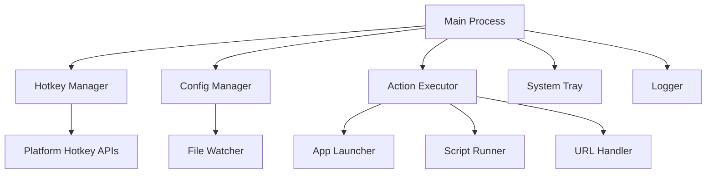

# Architecture

This document describes the internal architecture of SilentCast, helping developers understand the codebase structure and design decisions.

## Overview

SilentCast follows a modular architecture with clear separation of concerns:



## Project Structure

```
silentcast/
├── cmd/
│   └── silentcast/
│       └── main.go              # Entry point
├── internal/                    # Private packages
│   ├── action/                  # Action execution
│   │   ├── executor.go         # Action dispatcher
│   │   ├── app.go              # Application launcher
│   │   ├── script.go           # Script runner
│   │   └── url.go              # URL handler
│   ├── config/                 # Configuration management
│   │   ├── config.go           # Config structures
│   │   ├── loader.go           # YAML loading
│   │   ├── watcher.go          # File watching
│   │   └── validator.go        # Validation logic
│   ├── hotkey/                 # Keyboard handling
│   │   ├── manager.go          # Hotkey registration
│   │   ├── parser.go           # Key string parsing
│   │   └── platform_*.go       # Platform-specific
│   ├── permission/             # Permission handling
│   │   ├── manager.go          # Permission checks
│   │   └── platform_*.go       # Platform-specific
│   └── tray/                   # System tray
│       ├── tray.go             # Tray interface
│       └── menu.go             # Menu handling
├── pkg/                        # Public packages
│   └── logger/                 # Logging utilities
│       ├── logger.go           # Logger interface
│       └── rotation.go         # Log rotation
└── build/                      # Build artifacts
```

## Core Components

### Main Process

The main process coordinates all components:

```go
// cmd/silentcast/main.go
func main() {
    // 1. Parse command line arguments
    flags := parseFlags()
    
    // 2. Initialize logger
    log := logger.New(flags.LogLevel)
    
    // 3. Load configuration
    cfg := config.Load(flags.ConfigPath)
    
    // 4. Check permissions
    permission.CheckAndRequest()
    
    // 5. Initialize components
    hotkeyMgr := hotkey.NewManager()
    executor := action.NewExecutor()
    
    // 6. Register hotkeys
    registerHotkeys(cfg, hotkeyMgr, executor)
    
    // 7. Start system tray
    if !flags.NoTray {
        tray.Start()
    }
    
    // 8. Run main loop
    runMainLoop()
}
```

### Configuration System

#### Config Loading

```go
// internal/config/loader.go
type Loader struct {
    basePath     string
    platformPath string
}

func (l *Loader) Load() (*Config, error) {
    // 1. Load base configuration
    base := l.loadFile(l.basePath)
    
    // 2. Load platform overrides
    platform := l.loadFile(l.platformPath)
    
    // 3. Merge configurations
    return l.merge(base, platform)
}
```

#### Config Watching

```go
// internal/config/watcher.go
type Watcher struct {
    paths    []string
    onChange func(*Config)
}

func (w *Watcher) Start() {
    watcher := fsnotify.NewWatcher()
    
    for _, path := range w.paths {
        watcher.Add(path)
    }
    
    go w.handleEvents(watcher)
}
```

### Hotkey Management

#### Key Registration

```go
// internal/hotkey/manager.go
type Manager struct {
    prefix   Hotkey
    spells   map[string]string
    timeout  time.Duration
}

func (m *Manager) RegisterPrefix(keys string) error {
    // Parse key combination
    hotkey := parseHotkey(keys)
    
    // Register with OS
    return m.registerSystemHotkey(hotkey)
}
```

#### Platform Integration

```go
// internal/hotkey/platform_windows.go
// +build windows

func (m *Manager) registerSystemHotkey(h Hotkey) error {
    // Use Windows RegisterHotKey API
    return registerHotKey(h.Modifiers, h.Key)
}

// internal/hotkey/platform_darwin.go
// +build darwin

func (m *Manager) registerSystemHotkey(h Hotkey) error {
    // Use macOS CGEventTap API
    return registerEventTap(h.Modifiers, h.Key)
}
```

### Action Execution

#### Executor Pattern

```go
// internal/action/executor.go
type Executor struct {
    handlers map[string]Handler
}

type Handler interface {
    Execute(ctx context.Context, action Action) error
}

func (e *Executor) Execute(action Action) error {
    handler, ok := e.handlers[action.Type]
    if !ok {
        return fmt.Errorf("unknown action type: %s", action.Type)
    }
    
    ctx := context.WithTimeout(action.Timeout)
    return handler.Execute(ctx, action)
}
```

#### Action Handlers

```go
// internal/action/app.go
type AppHandler struct{}

func (h *AppHandler) Execute(ctx context.Context, action Action) error {
    cmd := exec.CommandContext(ctx, action.Command, action.Args...)
    cmd.Dir = action.WorkingDir
    cmd.Env = append(os.Environ(), formatEnv(action.Env)...)
    
    if action.Admin {
        return h.runAsAdmin(cmd)
    }
    
    return cmd.Start()
}
```

## Design Patterns

### Dependency Injection

Components receive dependencies through constructors:

```go
func NewExecutor(
    appLauncher Launcher,
    scriptRunner Runner,
    urlHandler Handler,
) *Executor {
    return &Executor{
        handlers: map[string]Handler{
            "app":    appLauncher,
            "script": scriptRunner,
            "url":    urlHandler,
        },
    }
}
```

### Interface Segregation

Small, focused interfaces:

```go
type ConfigLoader interface {
    Load(path string) (*Config, error)
}

type ConfigWatcher interface {
    Watch(path string, onChange func(*Config)) error
}

type ConfigValidator interface {
    Validate(cfg *Config) error
}
```

### Platform Abstraction

Platform-specific code behind interfaces:

```go
// internal/permission/manager.go
type Manager interface {
    Check() Status
    Request() error
}

// Platform-specific implementations
// internal/permission/manager_darwin.go
// internal/permission/manager_windows.go
```

## Concurrency Model

### Goroutine Usage

```go
// Main goroutines
func main() {
    // 1. Main thread - UI/System tray
    
    // 2. Hotkey listener goroutine
    go hotkeyManager.Listen()
    
    // 3. Config watcher goroutine
    go configWatcher.Watch()
    
    // 4. Update checker goroutine
    go updateChecker.Start()
    
    // 5. Action execution goroutines (per action)
    // Started on demand
}
```

### Channel Communication

```go
type HotkeyManager struct {
    events   chan HotkeyEvent
    actions  chan string
    shutdown chan struct{}
}

func (m *HotkeyManager) Listen() {
    for {
        select {
        case event := <-m.events:
            m.handleHotkey(event)
            
        case <-m.shutdown:
            return
        }
    }
}
```

## Error Handling

### Error Types

```go
// Custom error types
type ConfigError struct {
    Path string
    Err  error
}

type HotkeyError struct {
    Key string
    Err error
}

type ActionError struct {
    Action string
    Type   string
    Err    error
}
```

### Error Propagation

```go
func Execute(spell string) error {
    // Find action
    action, err := config.GetAction(spell)
    if err != nil {
        return fmt.Errorf("spell not found: %w", err)
    }
    
    // Execute action
    if err := executor.Execute(action); err != nil {
        return fmt.Errorf("execution failed: %w", err)
    }
    
    return nil
}
```

## Testing Strategy

### Unit Tests

```go
// internal/config/loader_test.go
func TestLoader_Merge(t *testing.T) {
    base := &Config{
        Spells: map[string]string{"e": "editor"},
    }
    
    override := &Config{
        Spells: map[string]string{"e": "vscode"},
    }
    
    result := merge(base, override)
    assert.Equal(t, "vscode", result.Spells["e"])
}
```

### Integration Tests

```go
// internal/hotkey/manager_test.go
func TestManager_RegisterAndTrigger(t *testing.T) {
    if runtime.GOOS == "linux" && os.Getenv("DISPLAY") == "" {
        t.Skip("Requires display")
    }
    
    mgr := NewManager()
    err := mgr.RegisterPrefix("ctrl+alt+t")
    require.NoError(t, err)
    
    // Simulate hotkey press
    event := simulateHotkey("ctrl+alt+t")
    assert.True(t, mgr.HandleEvent(event))
}
```

## Performance Considerations

### Memory Management

- Action execution in separate processes
- Configuration cached in memory
- Log rotation to prevent disk filling

### CPU Usage

- Event-driven architecture (no polling)
- Idle when no hotkeys pressed
- Efficient file watching with OS notifications

## Security Considerations

### Permission Model

- Minimal required permissions
- No network access by default
- Scripts run with user privileges

### Input Validation

- Sanitize all configuration inputs
- Validate hotkey combinations
- Path traversal prevention

## Future Architecture

### Planned Improvements

1. **Plugin System**: Allow external action handlers
2. **IPC Interface**: Control from other applications
3. **Distributed Config**: Share configurations across machines
4. **Action Marketplace**: Community-contributed actions

### API Design

```go
// Future plugin API
type Plugin interface {
    Name() string
    Version() string
    Actions() []ActionHandler
}

type ActionHandler interface {
    Type() string
    Execute(context.Context, map[string]interface{}) error
}
```

## Next Steps

- [Building](/api/building) - Build instructions
- [Testing](/api/testing) - Testing guide
- [Contributing](/api/contributing) - Contribution guidelines