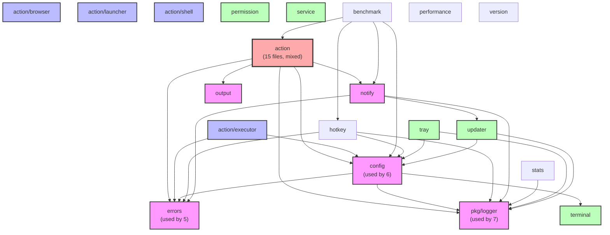

# SilentCast Package Structure Analysis - Ticket T068

## Executive Summary

This analysis identifies key architectural issues in the SilentCast codebase and provides actionable recommendations for improvement. The main findings are:

1. **No circular dependencies** - The dependency graph is acyclic ✅
2. **Action package has mixed responsibilities** - 15 files handling different concerns
3. **Duplicate shell functionality** - Identical interfaces in `action/shell.go` and `action/shell/shell.go`
4. **Import path inconsistencies** - Missing `/app` in import paths
5. **High platform-specific code ratio** - 36% of files are platform-specific

## Current Dependency Graph



## Critical Issues

### 1. Duplicate Shell Functionality

**Current State:**
- `action/shell.go` - Interface definition (ShellExecutor)
- `action/shell_*.go` - Platform implementations
- `action/shell/shell.go` - Duplicate interface (identical)
- `action/shell/shell_*.go` - Duplicate implementations

**Impact:** Confusion, maintenance overhead, potential bugs

**Solution:** Consolidate into `action/shell/` subdirectory

### 2. Action Package Structure

**Current Files in action/ root:**
```
app.go          - Application launching
script.go       - Script execution
shell.go        - Shell interface (duplicate)
elevated.go     - Elevated permissions
url.go          - URL handling
launcher.go     - App launcher interface
executor.go     - Main executor/manager
interface.go    - Common interfaces
launcher_*.go   - Platform launchers (3 files)
shell_*.go      - Platform shells (4 files)
```

**Issues:**
- Mixed responsibilities in single package
- Inconsistent organization (some in subdirs, some not)
- Platform files scattered in root

### 3. Interface Organization

**Current Interface Locations:**
```
action/interface.go          - Executor interface
action/executor/interface.go - Duplicate Executor interface
action/launcher/interface.go - Launcher interfaces
action/shell.go             - ShellExecutor interface
action/shell/shell.go       - Duplicate ShellExecutor
hotkey/interface.go         - Handler, Manager
notify/interface.go         - Notifier, OutputNotifier, UpdateNotifier
output/interface.go         - Manager
permission/interface.go     - Manager
service/interface.go        - Manager
terminal/interface.go       - Manager, CommandBuilder, Detector
```

**Issues:**
- Duplicate interface definitions
- Inconsistent naming (some Manager, some Executor)
- No clear interface hierarchy

## Recommendations

### Priority 1: Fix Duplicate Shell Functionality

**Action Items:**
1. Delete `action/shell.go` and related platform files
2. Move all shell functionality to `action/shell/` subdirectory
3. Update all imports

**Migration:**
```bash
# Remove duplicates
rm app/internal/action/shell.go
rm app/internal/action/shell_*.go

# Update imports in affected files
# From: "github.com/SphereStacking/silentcast/internal/action"
# To:   "github.com/SphereStacking/silentcast/app/internal/action/shell"
```

### Priority 2: Restructure Action Package

**Proposed Structure:**
```
action/
├── executor.go          # Main Manager and factory
├── interface.go         # Common Executor interface only
├── app/                 # Application launching
│   ├── executor.go      # AppExecutor implementation
│   ├── launcher.go      # Platform interface
│   └── launcher_*.go    # Platform implementations
├── script/              # Script execution
│   ├── executor.go      # ScriptExecutor implementation
│   └── runner.go        # Script running logic
├── shell/               # Shell execution (existing, cleaned)
│   ├── executor.go      # Shell command executor
│   ├── interface.go     # ShellExecutor interface
│   ├── detector.go      # Shell detection
│   └── shell_*.go       # Platform implementations
├── elevated/            # Elevated permissions
│   └── executor.go      # ElevatedExecutor
├── url/                 # URL handling
│   └── executor.go      # URLExecutor
└── browser/             # Browser operations (existing)
```

### Priority 3: Fix Import Paths

**Current Pattern (incorrect):**
```go
import "github.com/SphereStacking/silentcast/internal/config"
```

**Correct Pattern:**
```go
import "github.com/SphereStacking/silentcast/app/internal/config"
```

**Action:** Update all import statements project-wide

### Priority 4: Interface Standardization

**Proposed Interface Hierarchy:**
```go
// Common executor interface (action/interface.go)
type Executor interface {
    Execute(ctx context.Context) error
}

// Specific executors extend common interface
type AppExecutor interface {
    Executor
    SetTarget(target string)
}

type ScriptExecutor interface {
    Executor
    SetCommand(command string)
    SetEnvironment(env map[string]string)
}
```

## Implementation Plan

### Phase 1: Clean Up Duplicates (2 hours)
- [ ] Remove duplicate shell files
- [ ] Consolidate shell functionality
- [ ] Update imports for shell package
- [ ] Run tests to ensure nothing breaks

### Phase 2: Fix Import Paths (1 hour)
- [ ] Global search/replace for import paths
- [ ] Verify all imports are correct
- [ ] Run full build on all platforms

### Phase 3: Restructure Action Package (4 hours)
- [ ] Create new subdirectory structure
- [ ] Move files to appropriate locations
- [ ] Update imports throughout codebase
- [ ] Ensure tests pass at each step

### Phase 4: Interface Cleanup (2 hours)
- [ ] Remove duplicate interface definitions
- [ ] Standardize interface names
- [ ] Create interface documentation
- [ ] Add interface compliance tests

### Phase 5: Documentation (1 hour)
- [ ] Update package documentation
- [ ] Create architecture diagram
- [ ] Write ADR for structural decisions
- [ ] Update CLAUDE.md with new structure

## Metrics for Success

- **Zero circular dependencies** ✅ (already achieved)
- **No duplicate code** (remove shell duplicates)
- **Clear package responsibilities** (one package, one purpose)
- **Consistent import paths** (all use `/app`)
- **Well-documented interfaces** (godoc for all interfaces)
- **Improved test coverage** (maintain >90%)

## Long-term Benefits

1. **Improved Maintainability**
   - Clear separation of concerns
   - Easy to find and modify code
   - Reduced cognitive load

2. **Better Testability**
   - Isolated components
   - Clear interfaces for mocking
   - Faster test execution

3. **Enhanced Developer Experience**
   - Intuitive package structure
   - Consistent patterns
   - Clear documentation

4. **Reduced Technical Debt**
   - No duplicate code
   - Clean dependencies
   - Extensible architecture

## Conclusion

The SilentCast codebase has a solid foundation but needs structural improvements. The main issues are:

1. **Duplicate shell functionality** - Critical, fix immediately
2. **Mixed action package** - Important, restructure soon
3. **Import path inconsistencies** - Simple fix, high impact
4. **Interface organization** - Nice to have, improves clarity

Implementing these changes will significantly improve code quality and developer productivity without requiring a complete rewrite.