# Configuration File Structure

This guide explains the structure and organization of SilentCast configuration files.

## File Hierarchy

SilentCast uses a cascading configuration system:

```
~/.config/silentcast/
├── spellbook.yml           # Main configuration
├── spellbook.windows.yml   # Windows-specific overrides
├── spellbook.mac.yml       # macOS-specific overrides
└── spellbook.linux.yml     # Linux-specific overrides
```

## Configuration Loading Order

1. **Base configuration** (`spellbook.yml`) is loaded first
2. **Platform-specific file** is loaded based on the operating system
3. **Values are merged**, with platform-specific settings taking precedence

```mermaid
graph TD
    A[spellbook.yml] --> B{Operating System}
    B -->|Windows| C[spellbook.windows.yml]
    B -->|macOS| D[spellbook.mac.yml]
    B -->|Linux| E[spellbook.linux.yml]
    C --> F[Final Configuration]
    D --> F
    E --> F
    A --> F
```



## YAML Structure

### Root Level

```yaml
# Root level sections
daemon:     # Background service settings
logger:     # Logging configuration
hotkeys:    # Keyboard shortcut behavior
spells:     # Shortcut definitions
grimoire:   # Action definitions
```

### Daemon Section

Controls how SilentCast runs as a background service:

```yaml
daemon:
  auto_start: false          # Start with system
  log_level: info           # Verbosity: debug|info|warn|error
  config_watch: true        # Auto-reload on changes
  check_updates: true       # Check for new versions
  update_interval: 24       # Hours between update checks
```

### Logger Section

Configures detailed logging behavior:

```yaml
logger:
  level: info               # Log level
  file: ""                  # Path to log file (empty = console)
  max_size: 10             # MB before rotation
  max_backups: 3           # Number of old logs to keep
  max_age: 7               # Days to keep logs
  compress: false          # Compress rotated logs
```

### Hotkeys Section

Defines keyboard shortcut behavior:

```yaml
hotkeys:
  prefix: "alt+space"       # Activation key combination
  timeout: 1000            # ms to wait after prefix
  sequence_timeout: 2000   # ms for full sequence
  show_notification: true  # Visual feedback
  play_sound: false        # Audio feedback
```

### Spells Section

Maps keyboard shortcuts to actions:

```yaml
spells:
  # Single key
  e: "editor"
  
  # Multi-key sequence
  "g,s": "git_status"
  
  # Modified key
  "shift+e": "editor_admin"
  
  # Complex sequence
  "d,o,c": "open_docs"
```

### Grimoire Section

Defines what actions do:

```yaml
grimoire:
  action_name:
    type: app|script|url    # Action type
    command: "..."          # What to execute
    description: "..."      # Human-readable description
    # ... type-specific options
```

## Action Types

### Application Type

Launches applications:

```yaml
grimoire:
  editor:
    type: app
    command: "code"                    # Executable name or path
    args: ["--new-window"]            # Command line arguments
    working_dir: "~/projects"         # Starting directory
    env:                              # Environment variables
      NODE_ENV: "development"
    admin: false                      # Run as administrator
    wait: false                       # Wait for app to close
```

### Script Type

Executes shell commands:

```yaml
grimoire:
  git_status:
    type: script
    command: "git status"             # Shell command
    working_dir: "${PWD}"            # Execution directory
    shell: "bash"                    # Shell to use
    show_output: true                # Display output
    keep_open: false                 # Keep terminal open
    timeout: 30                      # Seconds before timeout
    env:                            # Environment variables
      TERM: "xterm-256color"
```

### URL Type

Opens URLs in browser:

```yaml
grimoire:
  documentation:
    type: url
    command: "https://silentcast.dev"  # URL to open
    browser: "default"                 # Browser to use
    incognito: false                   # Private browsing mode
```

## Configuration Inheritance

### Base Configuration

```yaml
# spellbook.yml
grimoire:
  terminal:
    type: app
    command: "terminal"
    description: "Open terminal"
```

### Platform Override

```yaml
# spellbook.windows.yml
grimoire:
  terminal:
    command: "wt"  # Override just the command
    # Other properties inherited from base
```

### Result

The final configuration for Windows would be:

```yaml
grimoire:
  terminal:
    type: app
    command: "wt"              # From Windows override
    description: "Open terminal"  # From base
```

## Advanced Features

### Variable Substitution

```yaml
grimoire:
  open_config:
    type: app
    command: "${EDITOR:-notepad}"
    args: ["${SILENTCAST_CONFIG}/spellbook.yml"]
```

### Conditional Configuration

```yaml
grimoire:
  deploy:
    type: script
    command: |
      if [ "${ENVIRONMENT}" = "production" ]; then
        ./deploy-prod.sh
      else
        ./deploy-dev.sh
      fi
```

### Including External Files

While not directly supported, you can use shell scripts:

```yaml
grimoire:
  load_secrets:
    type: script
    command: "source ~/.secrets && echo $API_KEY"
```

## Best Practices

### Organization

1. **Group related spells**:
   ```yaml
   spells:
     # Git commands
     "g,s": "git_status"
     "g,p": "git_pull"
     "g,c": "git_commit"
     
     # Docker commands
     "d,u": "docker_up"
     "d,d": "docker_down"
   ```

2. **Use descriptive action names**:
   ```yaml
   grimoire:
     open_project_in_vscode:  # Clear and specific
       type: app
       command: "code"
   ```

### Platform Handling

1. **Keep common settings in base**:
   ```yaml
   # spellbook.yml
   hotkeys:
     prefix: "alt+space"
     timeout: 1000
   ```

2. **Override only what's different**:
   ```yaml
   # spellbook.mac.yml
   grimoire:
     terminal:
       command: "Terminal"  # Only override the command
   ```

### Security

1. **Don't store secrets**:
   ```yaml
   # Bad
   env:
     API_KEY: "sk-1234567890"
   
   # Good
   env:
     API_KEY: "${API_KEY}"  # From environment
   ```

2. **Use absolute paths for scripts**:
   ```yaml
   command: "/home/user/scripts/deploy.sh"  # Not just "deploy.sh"
   ```

## Validation

### Check Structure

```bash
# Validate YAML syntax
silentcast --validate-config

# Show parsed configuration
silentcast --show-config
```

### Common Issues

1. **Indentation errors**:
   ```yaml
   # Bad - tabs
   spells:
   	e: "editor"
   
   # Good - spaces
   spells:
     e: "editor"
   ```

2. **Missing quotes**:
   ```yaml
   # Bad
   spells:
     g,s: git_status  # Comma needs quotes
   
   # Good
   spells:
     "g,s": "git_status"
   ```

3. **Invalid nesting**:
   ```yaml
   # Bad
   grimoire:
   editor:
     type: app
   
   # Good
   grimoire:
     editor:
       type: app
   ```

## Next Steps

- [Configuration Guide](/config/configuration-guide) - Detailed configuration options
- [Platform Support](/guide/platforms) - Platform-specific considerations
- [Examples](/guide/samples) - Real-world configurations