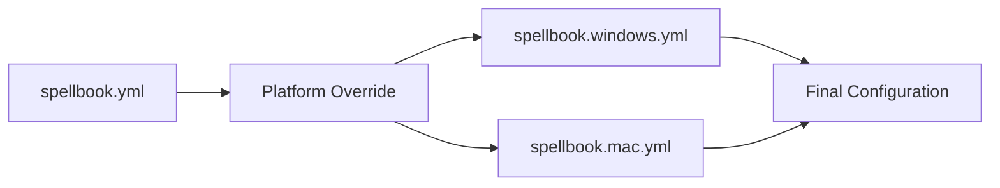

# Configuration Reference

This section provides a complete reference for all SilentCast configuration options. Use this guide to understand every available setting and customize SilentCast to your needs.

## Configuration Files

SilentCast uses a cascading configuration system:



## File Structure Overview

```yaml
# Complete configuration structure
daemon:       # Daemon settings
  auto_start: boolean
  log_level: string
  config_watch: boolean
  check_updates: boolean
  update_interval: number

logger:       # Logging configuration
  level: string
  file: string
  max_size: number
  max_backups: number
  max_age: number
  compress: boolean

hotkeys:      # Hotkey behavior
  prefix: string
  timeout: number
  sequence_timeout: number
  show_notification: boolean
  play_sound: boolean

spells:       # Shortcut definitions
  key: action_name

grimoire:     # Action definitions
  action_name:
    type: string
    command: string
    # ... type-specific options
```

## Quick Links

- [Configuration Guide](/config/configuration-guide) - Detailed configuration guide
- [Getting Started](/guide/getting-started) - Quick start guide
- [Configuration Examples](/guide/samples) - Real-world configuration examples
- [Platform Support](/guide/platforms) - OS-specific configurations

## Complete Example

Here's a fully-featured configuration file with all options:

```yaml
# spellbook.yml - Complete example with all options

# Daemon configuration controls how SilentCast runs
daemon:
  # Start automatically when system boots
  auto_start: false
  
  # Logging verbosity: debug, info, warn, error
  log_level: info
  
  # Watch configuration files for changes
  config_watch: true
  
  # Check for updates automatically
  check_updates: true
  
  # How often to check for updates (hours)
  update_interval: 24

# Logger configuration for detailed logging
logger:
  # Log level: debug, info, warn, error
  level: info
  
  # Log file path (empty = console only)
  # Supports ~ for home directory
  file: "~/.local/share/silentcast/silentcast.log"
  
  # Maximum size in MB before rotation
  max_size: 10
  
  # Number of old log files to keep
  max_backups: 3
  
  # Maximum age in days
  max_age: 7
  
  # Compress rotated log files
  compress: true

# Hotkey settings control keyboard shortcuts
hotkeys:
  # The activation key combination
  # Format: modifier+key (e.g., "alt+space", "ctrl+shift+p")
  prefix: "alt+space"
  
  # Milliseconds to wait after prefix before timeout
  timeout: 1000
  
  # Total milliseconds for multi-key sequences
  sequence_timeout: 2000
  
  # Show notification when prefix is pressed
  show_notification: true
  
  # Play sound on successful spell cast
  play_sound: false

# Spells map keyboard shortcuts to actions
spells:
  # Single key shortcuts
  e: "editor"           # Open editor
  t: "terminal"         # Open terminal
  b: "browser"          # Open browser
  
  # Multi-key sequences (VS Code style)
  "g,s": "git_status"   # Git status
  "g,p": "git_pull"     # Git pull
  "g,c": "git_commit"   # Git commit
  
  # Modified keys
  "shift+e": "editor_admin"  # Editor as admin
  "ctrl+d": "duplicate"      # Duplicate file

# Grimoire contains action definitions
grimoire:
  # Application launch action
  editor:
    type: app
    command: "code"
    description: "Open Visual Studio Code"
    args: ["--new-window"]
    working_dir: "~/projects"
    env:
      NODE_ENV: "development"
    
  # Script execution action
  git_status:
    type: script
    command: "git status"
    description: "Show git repository status"
    working_dir: "${PWD}"
    show_output: true
    keep_open: false
    shell: "bash"
    timeout: 30
    
  # URL opening action
  documentation:
    type: url
    command: "https://silentcast.dev/docs"
    description: "Open documentation"
    browser: "default"
```

## Configuration Validation

Validate your configuration:

```bash
# Check current configuration
silentcast --validate-config

# Check specific file
silentcast --config ./test-spellbook.yml --validate-config

# Show resolved configuration
silentcast --show-config
```

## Environment Variables in Configuration

You can use environment variables throughout your configuration:

```yaml
grimoire:
  open_project:
    type: app
    command: "${EDITOR:-code}"
    working_dir: "${PROJECT_DIR}"
    env:
      API_KEY: "${API_KEY}"
      DEBUG: "${DEBUG:-false}"
```

Available built-in variables:
- `${HOME}` - User home directory
- `${USER}` - Current username  
- `${PWD}` - Current working directory
- `${SILENTCAST_CONFIG}` - Config directory path
- `${SILENTCAST_VERSION}` - Current version

## Type Definitions

### Action Types

| Type | Purpose | Required Fields |
|------|---------|----------------|
| `app` | Launch applications | `command` |
| `script` | Execute shell commands | `command` |
| `url` | Open URLs in browser | `command` |

### Data Types

| Field | Type | Valid Values |
|-------|------|--------------|
| `auto_start` | boolean | `true`, `false` |
| `log_level` | string | `debug`, `info`, `warn`, `error` |
| `timeout` | number | Milliseconds (e.g., `1000`) |
| `prefix` | string | Key combination (e.g., `"alt+space"`) |
| `type` | string | `app`, `script`, `url` |

## Default Values

If not specified, these defaults are used:

```yaml
daemon:
  auto_start: false
  log_level: "info"
  config_watch: true
  check_updates: true
  update_interval: 24

logger:
  level: "info"
  file: ""  # Console only
  max_size: 10
  max_backups: 3
  max_age: 7
  compress: false

hotkeys:
  prefix: "alt+space"
  timeout: 1000
  sequence_timeout: 2000
  show_notification: true
  play_sound: false

# Action defaults
grimoire:
  any_action:
    # App type defaults
    args: []
    working_dir: "."
    env: {}  # Inherits system env
    
    # Script type defaults
    shell: "sh"  # or system default
    show_output: false
    keep_open: false
    timeout: 30
    
    # URL type defaults
    browser: "default"
```

## Best Practices

1. **Start Simple**: Begin with basic shortcuts and add complexity as needed
2. **Use Comments**: Document complex configurations
3. **Test Changes**: Use `--dry-run` to test without executing
4. **Version Control**: Keep your spellbook in git
5. **Platform Separation**: Use platform-specific files for OS differences

## Next Steps

Dive deeper into specific configuration areas:

- [Configuration Guide](/config/configuration-guide) - Complete configuration reference
- [Spells Guide](/guide/spells) - Spell configuration
- [Grimoire Guide](/guide/grimoire) - Grimoire entries
- [Platform Support](/guide/platforms) - OS-specific settings
- [Configuration Examples](/guide/samples) - Real-world configurations