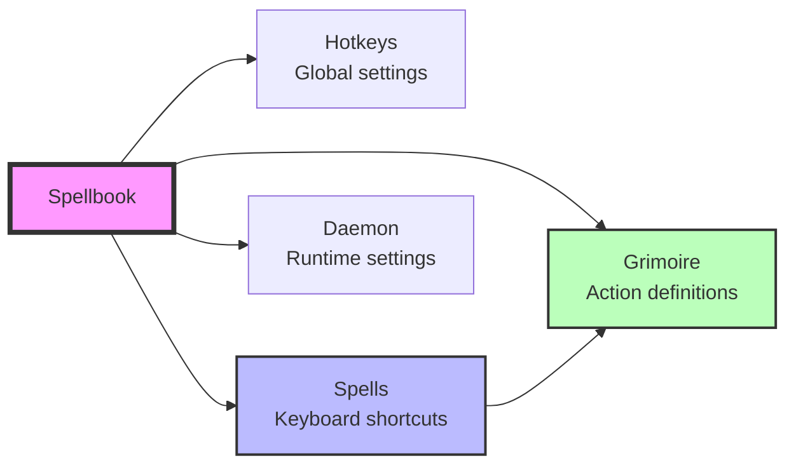

# Configuration Guide

SilentCast uses YAML configuration files called **spellbooks** to define your keyboard spells and the grimoire of actions they trigger. This guide covers everything you need to master the magic.

## 🎯 Quick Start

Create your first spellbook:

```yaml
# ~/.config/silentcast/spellbook.yml
hotkeys:
  prefix: "alt+space"      # Your magic activation key

spells:
  e: "editor"              # Alt+Space, then E
  t: "terminal"            # Alt+Space, then T
  "g,s": "git_status"      # Alt+Space, then G, then S

grimoire:
  editor:
    type: app
    command: "code"
    
  terminal:
    type: app
    command: "wt"          # Windows Terminal
    
  git_status:
    type: script
    command: "git status"
    show_output: true      # Display result in notification
```

That's it! Save the file and SilentCast will automatically reload your configuration.

## 📁 File Locations

SilentCast searches for spellbooks in these locations (first found wins):

::: code-group

```bash [macOS/Linux]
# Primary locations (recommended)
~/.config/silentcast/spellbook.yml
~/.config/silentcast/spellbook.{os}.yml    # Platform-specific

# Alternative locations
~/.silentcast/spellbook.yml
/etc/silentcast/spellbook.yml              # System-wide

# Development
./spellbook.yml                            # Current directory
${SILENTCAST_CONFIG}/spellbook.yml         # Custom path
```

```powershell [Windows]
# Primary locations (recommended)
%APPDATA%\SilentCast\spellbook.yml
%APPDATA%\SilentCast\spellbook.windows.yml # Platform-specific

# Alternative locations
%USERPROFILE%\.silentcast\spellbook.yml
C:\ProgramData\SilentCast\spellbook.yml    # System-wide

# Development
.\spellbook.yml                            # Current directory
%SILENTCAST_CONFIG%\spellbook.yml          # Custom path
```

:::

## 🏗️ Configuration Structure

### Overview



### Complete Configuration Reference

```yaml
# ========================================
# SilentCast Spellbook - Complete Reference
# ========================================

# Runtime configuration
daemon:
  auto_start: false        # Start with system
  log_level: info          # debug, info, warn, error
  config_watch: true       # Auto-reload on changes
  check_updates: true      # Check for new versions
  update_interval: 24      # Hours between checks

# Logging configuration
logger:
  level: info              # Logging verbosity
  file: ""                 # Empty = console only
  max_size: 10             # MB before rotation
  max_backups: 3           # Rotated files to keep
  max_age: 7               # Days to keep logs
  compress: true           # Compress old logs

# Global hotkey settings
hotkeys:
  prefix: "alt+space"      # Magic activation key
  timeout: 1000            # ms after prefix
  sequence_timeout: 2000   # ms for full sequence
  show_notification: true  # Visual feedback
  play_sound: false        # Audio feedback

# Keyboard spell mappings
spells:
  # Single-key spells
  e: "editor"              # Open editor
  t: "terminal"            # Open terminal
  b: "browser"             # Open browser
  
  # Multi-key sequences (VS Code style)
  "g,s": "git_status"      # Git status
  "g,p": "git_pull"        # Git pull
  "g,c": "git_commit"      # Git commit
  
  # Nested sequences
  "d,u": "docker_up"       # Docker up
  "d,d": "docker_down"     # Docker down
  "d,l": "docker_logs"     # Docker logs

# Action definitions
grimoire:
  # Application launch
  editor:
    type: app
    command: "code"
    args: ["--new-window"]
    working_dir: "~/projects"
    description: "Open VS Code"
    
  # Script execution
  git_status:
    type: script
    command: "git status"
    show_output: true
    working_dir: "${PWD}"
    description: "Show repository status"
    
  # URL opening
  docs:
    type: url
    command: "https://silentcast.dev"
    description: "Open documentation"
```

## 🧙 Spell Patterns

### Single-Key Spells

The simplest spells - press prefix, then a single key:

```yaml
spells:
  e: "editor"        # Alt+Space → E
  t: "terminal"      # Alt+Space → T
  b: "browser"       # Alt+Space → B
  f: "files"         # Alt+Space → F
  s: "search"        # Alt+Space → S
```

### Multi-Key Sequences

Chain keys for grouped functionality:

```yaml
spells:
  # Git commands (g prefix)
  "g,s": "git_status"       # Alt+Space → G → S
  "g,p": "git_pull"         # Alt+Space → G → P
  "g,c": "git_commit"       # Alt+Space → G → C
  "g,d": "git_diff"         # Alt+Space → G → D
  "g,l": "git_log"          # Alt+Space → G → L
  
  # Docker commands (d prefix)
  "d,u": "docker_up"        # Alt+Space → D → U
  "d,d": "docker_down"      # Alt+Space → D → D
  "d,p": "docker_ps"        # Alt+Space → D → P
  "d,r": "docker_restart"   # Alt+Space → D → R
  
  # Window management (w prefix)
  "w,m": "window_maximize"  # Alt+Space → W → M
  "w,c": "window_center"    # Alt+Space → W → C
  "w,l": "window_left"      # Alt+Space → W → L
  "w,r": "window_right"     # Alt+Space → W → R
```

### Special Keys

Use these modifiers and special keys:

```yaml
hotkeys:
  # Modifiers
  prefix: "ctrl+shift+space"    # Multiple modifiers
  prefix: "cmd+space"           # macOS Command key
  prefix: "win+space"           # Windows key
  
  # Function keys
  prefix: "f13"                 # Function keys F1-F24
  
  # Special keys
  prefix: "pause"               # Pause/Break key
  prefix: "scroll_lock"         # Scroll Lock
```

## 📚 Grimoire Entry Types

### Type: `app` - Launch Applications

```yaml
grimoire:
  # Simple app launch
  editor:
    type: app
    command: "code"
    
  # With arguments
  browser_dev:
    type: app
    command: "chrome"
    args: ["--new-window", "--incognito", "https://localhost:3000"]
    
  # With working directory
  project_editor:
    type: app
    command: "code"
    working_dir: "~/projects/myapp"
    args: ["."]
    
  # With environment variables
  custom_app:
    type: app
    command: "myapp"
    env:
      NODE_ENV: "development"
      DEBUG: "true"
    working_dir: "${PROJECT_ROOT}"
```

### Type: `script` - Execute Commands

```yaml
grimoire:
  # Simple command
  list_files:
    type: script
    command: "ls -la"
    
  # Show output in notification
  git_status:
    type: script
    command: "git status --short"
    show_output: true
    
  # Keep terminal open
  server_logs:
    type: script
    command: "tail -f server.log"
    terminal: true
    keep_open: true
    
  # Multi-line script
  deploy:
    type: script
    command: |
      echo "Starting deployment..."
      git pull origin main
      npm install
      npm run build
      echo "Deployment complete!"
    show_output: true
    
  # With timeout
  long_process:
    type: script
    command: "./backup.sh"
    timeout: 300  # 5 minutes
    
  # Custom shell
  powershell_script:
    type: script
    command: "Get-Process | Where CPU -gt 50"
    shell: "pwsh"
    show_output: true
```

### Type: `url` - Open Web Pages

```yaml
grimoire:
  # Simple URL
  docs:
    type: url
    command: "https://silentcast.dev"
    
  # With parameters
  search:
    type: url
    command: "https://google.com/search?q=${QUERY}"
    
  # Local development
  localhost:
    type: url
    command: "http://localhost:${PORT:-3000}"
```

### Type: `elevated` - Admin/Sudo Commands

```yaml
grimoire:
  # Windows admin
  update_system:
    type: elevated
    command: "winget upgrade --all"
    terminal: true
    
  # macOS/Linux sudo
  install_package:
    type: elevated
    command: "apt update && apt upgrade -y"
    terminal: true
    keep_open: true
```

## 🎨 Platform-Specific Configuration

### Configuration Cascade

SilentCast loads configurations in this order:
1. Base `spellbook.yml`
2. Platform-specific override (e.g., `spellbook.mac.yml`)
3. Merge configurations (platform wins conflicts)

### macOS Overrides

```yaml
# ~/.config/silentcast/spellbook.mac.yml
grimoire:
  # Override terminal for macOS
  terminal:
    command: "Terminal"    # or "iTerm"
    
  # macOS-specific entries
  finder:
    type: app
    command: "Finder"
    
  spotlight:
    type: script
    command: "open -a Spotlight"
    
  screenshot:
    type: script
    command: |
      screencapture -i ~/Desktop/screenshot-$(date +%Y%m%d-%H%M%S).png
    description: "Interactive screenshot"

# Add macOS-specific spells
spells:
  "m,f": "finder"
  "m,s": "spotlight"
  "s,s": "screenshot"
```

### Windows Overrides

```yaml
# %APPDATA%\SilentCast\spellbook.windows.yml
grimoire:
  # Windows-specific terminal
  terminal:
    command: "wt"          # Windows Terminal
    # command: "pwsh"      # PowerShell
    # command: "cmd"       # Command Prompt
    
  # Windows-specific entries
  explorer:
    type: app
    command: "explorer"
    
  task_manager:
    type: app
    command: "taskmgr"
    
  snip:
    type: app
    command: "SnippingTool"
    
  admin_cmd:
    type: elevated
    command: "cmd"
    args: ["/k", "echo Running as Administrator"]

spells:
  "w,e": "explorer"
  "w,t": "task_manager"
  "s,s": "snip"
```

### Linux Overrides

```yaml
# ~/.config/silentcast/spellbook.linux.yml
grimoire:
  terminal:
    command: "gnome-terminal"  # or "konsole", "xterm", etc.
    
  file_manager:
    command: "nautilus"        # or "dolphin", "thunar", etc.
    
  screenshot:
    type: script
    command: "gnome-screenshot -i"
    
  system_monitor:
    type: app
    command: "gnome-system-monitor"

spells:
  "l,s": "system_monitor"
  "s,s": "screenshot"
```

## 🔧 Advanced Features

### Environment Variables

Use system and custom environment variables:

```yaml
grimoire:
  dev_server:
    type: script
    command: "npm run dev"
    working_dir: "${PROJECT_ROOT}"
    env:
      PORT: "${DEV_PORT:-3000}"
      NODE_ENV: "development"
      API_URL: "${API_URL:-http://localhost:8080}"
```

Built-in variables:
- `${HOME}` - User home directory
- `${PWD}` - Current working directory
- `${USER}` - Username
- `${SILENTCAST_CONFIG}` - Config directory
- `${SILENTCAST_VERSION}` - Version

### Conditional Logic

Use shell scripting for smart actions:

```yaml
grimoire:
  smart_git:
    type: script
    command: |
      if [ -d .git ]; then
        git status
      else
        echo "Not a git repository"
        exit 1
      fi
    show_output: true
    
  os_specific:
    type: script
    command: |
      case "$(uname -s)" in
        Darwin*) echo "Running on macOS" ;;
        Linux*)  echo "Running on Linux" ;;
        CYGWIN*|MINGW*) echo "Running on Windows" ;;
      esac
```

### Action Chaining

Execute multiple actions in sequence:

```yaml
grimoire:
  full_deploy:
    type: script
    command: |
      # Stop services
      docker-compose down
      
      # Update code
      git pull origin main
      
      # Rebuild
      docker-compose build
      
      # Run migrations
      docker-compose run --rm app npm run migrate
      
      # Start services
      docker-compose up -d
      
      # Show status
      docker-compose ps
    terminal: true
    keep_open: true
```

## 📊 Best Practices

### 1. Logical Grouping

Organize spells by function:

```yaml
spells:
  # Applications (single keys)
  e: "editor"
  t: "terminal"
  b: "browser"
  
  # Git operations (g prefix)
  "g,s": "git_status"
  "g,p": "git_pull"
  "g,c": "git_commit"
  
  # Docker operations (d prefix)
  "d,u": "docker_up"
  "d,d": "docker_down"
  
  # System operations (s prefix)
  "s,r": "system_restart"
  "s,l": "system_lock"
```

### 2. Consistent Naming

Use clear, descriptive names:

```yaml
grimoire:
  # Good - Clear and descriptive
  open_project_in_vscode:
    type: app
    command: "code"
    working_dir: "~/projects/myapp"
    
  # Bad - Too cryptic
  opvc:
    type: app
    command: "code"
```

### 3. Documentation

Add descriptions to complex entries:

```yaml
grimoire:
  complex_deployment:
    type: script
    # This script performs a full deployment:
    # 1. Backs up the database
    # 2. Pulls latest code
    # 3. Runs migrations
    # 4. Restarts services
    command: "./deploy.sh"
    description: "Full production deployment with backup"
    timeout: 600
```

### 4. Error Handling

Add error checking to scripts:

```yaml
grimoire:
  safe_deploy:
    type: script
    command: |
      set -e  # Exit on error
      
      echo "Starting deployment..."
      
      # Check prerequisites
      if ! command -v docker &> /dev/null; then
        echo "Error: Docker not found"
        exit 1
      fi
      
      # Continue with deployment
      docker-compose down
      git pull || { echo "Git pull failed"; exit 1; }
      docker-compose up -d
```

## 🧪 Testing & Validation

### Validate Configuration

```bash
# Check syntax
silentcast --validate-config

# Show resolved configuration
silentcast --show-config

# Test specific config file
silentcast --config ./test-spellbook.yml --validate-config
```

### Test Spells

```bash
# List all spells
silentcast --list-spells

# Test without executing
silentcast --dry-run --spell=e

# Test specific spell
silentcast --test-spell --spell=git_status

# Debug mode
silentcast --debug --no-tray
```

### Monitor Configuration

```bash
# Watch configuration changes
silentcast --debug 2>&1 | grep "Config"

# Check reload events
tail -f ~/.config/silentcast/silentcast.log | grep "reload"
```

## 🔍 Troubleshooting

### Configuration Not Loading

1. **Check file location**:
   ```bash
   silentcast --show-config-path
   ```

2. **Validate YAML syntax**:
   ```bash
   # Online validator
   cat spellbook.yml | python -c "import yaml,sys; yaml.safe_load(sys.stdin)"
   ```

3. **Check permissions**:
   ```bash
   ls -la ~/.config/silentcast/
   ```

### Spells Not Working

1. **Test prefix key**: Try a simple spell first
2. **Check conflicts**: Some keys may be reserved by OS
3. **Enable debug logging**:
   ```yaml
   daemon:
     log_level: debug
   ```
4. **Monitor logs**:
   ```bash
   tail -f ~/.config/silentcast/silentcast.log
   ```

### Platform Issues

- **macOS**: Check accessibility permissions
- **Windows**: Run as administrator for elevated actions
- **Linux**: Check if running under Wayland (limited hotkey support)

## 📖 Example Configurations

Find complete examples in the repository:

- [Basic spellbook](https://github.com/SphereStacking/silentcast/blob/main/examples/config/basic_spellbook.yml)
- [Developer spellbook](https://github.com/SphereStacking/silentcast/blob/main/examples/config/developer_spellbook.yml)
- [Power user spellbook](https://github.com/SphereStacking/silentcast/blob/main/examples/config/power_user_spellbook.yml)
- [Platform examples](https://github.com/SphereStacking/silentcast/tree/main/examples/config)

## 🚀 Next Steps

- [Learn about spell patterns](./spells.md) - Master keyboard combinations
- [Explore scripting](./scripts.md) - Advanced automation
- [Platform features](./platforms.md) - OS-specific capabilities
- [CLI reference](./cli-reference.md) - Command-line options

---

<div align="center">
  <p><strong>Happy spell casting! 🪄</strong></p>
</div>