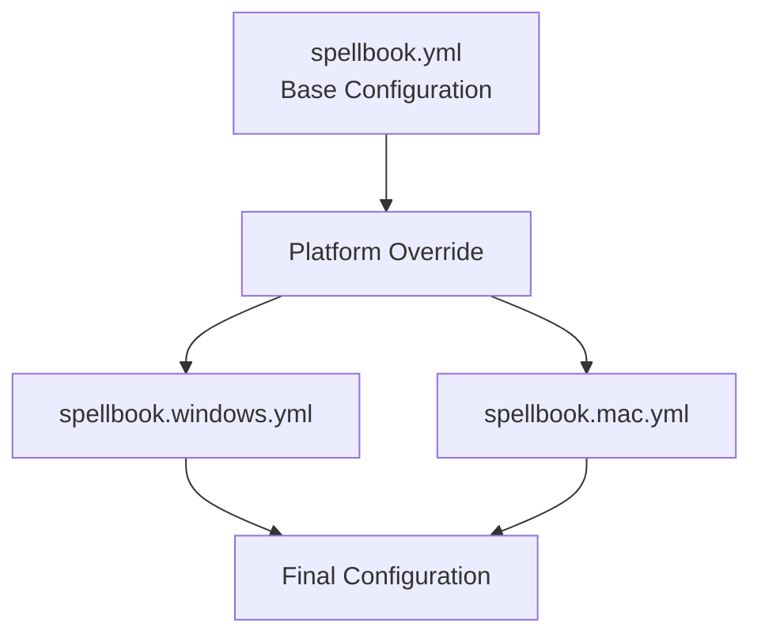

# Configuration Guide

SilentCast uses YAML configuration files to define your shortcuts and actions. This guide covers everything you need to know about configuration.

## Configuration Overview

SilentCast follows a simple configuration model:



## File Locations

SilentCast looks for configuration files in these locations (in order):

::: code-group

```bash [macOS]
# Primary locations
~/.config/silentcast/spellbook.yml
~/.config/silentcast/spellbook.mac.yml

# Alternative locations
~/.silentcast/spellbook.yml
/etc/silentcast/spellbook.yml

# Current directory (for development)
./spellbook.yml
```

```powershell [Windows]
# Primary locations
%APPDATA%\SilentCast\spellbook.yml
%APPDATA%\SilentCast\spellbook.windows.yml

# Alternative locations
%USERPROFILE%\.silentcast\spellbook.yml
C:\ProgramData\SilentCast\spellbook.yml

# Current directory (for development)
.\spellbook.yml
```

:::

## Basic Configuration Structure

Here's a complete example with all available options:

```yaml
# spellbook.yml - Your magic configuration
# This is the main configuration file that works across all platforms

# Daemon settings control how SilentCast runs
daemon:
  # Start automatically when system boots
  auto_start: false
  
  # Logging level: debug, info, warn, error
  log_level: info
  
  # Watch config file for changes and auto-reload
  config_watch: true
  
  # Check for updates automatically
  check_updates: true
  
  # Update check interval in hours
  update_interval: 24

# Logger configuration for detailed logging
logger:
  # Log level: debug, info, warn, error
  level: info
  
  # Log file path (empty = console only)
  file: "~/.local/share/silentcast/silentcast.log"
  
  # Maximum size in MB before rotation
  max_size: 10
  
  # Number of old log files to keep
  max_backups: 3
  
  # Maximum age in days
  max_age: 7
  
  # Compress rotated log files
  compress: true

# Hotkey settings define how shortcuts work
hotkeys:
  # The magic activation key (prefix)
  prefix: "alt+space"
  
  # Milliseconds to wait after prefix
  timeout: 1000
  
  # Total milliseconds for multi-key sequences
  sequence_timeout: 2000
  
  # Show notification when prefix is pressed
  show_notification: true
  
  # Play sound on successful spell cast
  play_sound: false

# Spells define your keyboard shortcuts
spells:
  # Single key spells
  e: "editor"          # Alt+Space, E
  t: "terminal"        # Alt+Space, T
  b: "browser"         # Alt+Space, B
  f: "file_manager"    # Alt+Space, F
  
  # Multi-key sequences (VS Code style)
  "g,s": "git_status"     # Alt+Space, G, S
  "g,p": "git_pull"       # Alt+Space, G, P
  "g,c": "git_commit"     # Alt+Space, G, C
  "g,d": "git_diff"       # Alt+Space, G, D
  
  # Docker sequences
  "d,u": "docker_up"      # Alt+Space, D, U
  "d,d": "docker_down"    # Alt+Space, D, D
  "d,l": "docker_logs"    # Alt+Space, D, L
  "d,p": "docker_ps"      # Alt+Space, D, P
  
  # Custom sequences
  "w,s": "web_server"     # Alt+Space, W, S
  "t,r": "test_run"       # Alt+Space, T, R
  "b,d": "build_deploy"   # Alt+Space, B, D

# Grimoire contains the actual commands/actions
grimoire:
  # Application launches
  editor:
    type: app
    command: "code"
    description: "Open Visual Studio Code"
    # Optional: arguments to pass
    args: ["--new-window"]
    # Optional: working directory
    working_dir: "~/projects"
    
  terminal:
    type: app
    command: "wt"  # Will be overridden per platform
    description: "Open terminal emulator"
    
  browser:
    type: app
    command: "chrome"
    description: "Open web browser"
    args: ["--new-window"]
    
  file_manager:
    type: app
    command: "explorer"  # Will be overridden per platform
    description: "Open file manager"
    
  # Script executions
  git_status:
    type: script
    command: "git status"
    description: "Show git repository status"
    # Use environment variables
    working_dir: "${PWD}"
    # Show output in notification
    show_output: true
    
  git_pull:
    type: script
    command: "git pull origin main"
    description: "Pull latest changes from main"
    working_dir: "${PWD}"
    
  git_commit:
    type: script
    # Multi-line scripts
    command: |
      git add -A
      git commit -m "Quick commit from SilentCast"
    description: "Stage and commit all changes"
    
  docker_up:
    type: script
    command: "docker-compose up -d"
    description: "Start Docker containers"
    working_dir: "${PWD}"
    
  docker_logs:
    type: script
    command: "docker-compose logs -f --tail=100"
    description: "Show Docker logs"
    # Keep terminal open after execution
    keep_open: true
    
  # Complex example with environment variables
  web_server:
    type: script
    command: "python -m http.server ${PORT:-8000}"
    description: "Start Python web server"
    env:
      PORT: "3000"
    keep_open: true
    
  # URL opening
  docs:
    type: url
    command: "https://silentcast.dev/docs"
    description: "Open documentation"
```

## Platform-Specific Overrides

Create platform-specific files to override settings:

::: code-group

```yaml [spellbook.mac.yml]
# macOS specific overrides
grimoire:
  terminal:
    command: "Terminal"
    # Or use iTerm2
    # command: "iTerm"
    
  file_manager:
    command: "Finder"
    
  # macOS specific shortcuts
  spotlight:
    type: script
    command: "open -a 'Spotlight'"
    description: "Open Spotlight search"
    
  screenshot:
    type: script
    command: "screencapture -i ~/Desktop/screenshot.png"
    description: "Take interactive screenshot"

# Add macOS specific spells
spells:
  "s,s": "screenshot"
  "s,p": "spotlight"
```

```yaml [spellbook.windows.yml]
# Windows specific overrides
grimoire:
  terminal:
    command: "wt"  # Windows Terminal
    # Or use PowerShell
    # command: "pwsh"
    # Or classic cmd
    # command: "cmd"
    
  file_manager:
    command: "explorer"
    
  # Windows specific
  task_manager:
    type: app
    command: "taskmgr"
    description: "Open Task Manager"
    
  snipping_tool:
    type: app
    command: "SnippingTool"
    description: "Open Snipping Tool"

spells:
  "w,t": "task_manager"
  "s,s": "snipping_tool"
```

:::

## Advanced Configuration

### Environment Variables

Use environment variables in your commands:

```yaml
grimoire:
  open_project:
    type: app
    command: "${EDITOR:-code}"
    args: ["${PROJECT_DIR}/src"]
    working_dir: "${PROJECT_DIR}"
    env:
      NODE_ENV: "development"
      DEBUG: "true"
```

### Conditional Commands

Use shell conditionals for smart commands:

```yaml
grimoire:
  smart_git:
    type: script
    command: |
      if [ -d .git ]; then
        git status
      else
        echo "Not a git repository"
      fi
    show_output: true
```

### Template Variables

SilentCast provides these built-in variables:

| Variable | Description | Example |
|----------|-------------|---------|
| `${HOME}` | User home directory | `/home/user` |
| `${PWD}` | Current working directory | `/home/user/project` |
| `${USER}` | Current username | `john` |
| `${SILENTCAST_CONFIG}` | Config directory | `~/.config/silentcast` |
| `${SILENTCAST_VERSION}` | SilentCast version | `1.0.0` |

### Action Types

#### Type: `app`
Launches applications:

```yaml
grimoire:
  my_app:
    type: app
    command: "code"           # Required: executable name/path
    args: ["--new-window"]    # Optional: command arguments
    working_dir: "~/projects" # Optional: working directory
    env:                      # Optional: environment variables
      NODE_ENV: "dev"
```

#### Type: `script`
Executes shell commands:

```yaml
grimoire:
  my_script:
    type: script
    command: "npm run dev"    # Required: shell command
    working_dir: "${PWD}"     # Optional: working directory
    show_output: true         # Optional: show output notification
    keep_open: true          # Optional: keep terminal open
    shell: "bash"            # Optional: shell to use
```

#### Type: `url`
Opens URLs in default browser:

```yaml
grimoire:
  my_url:
    type: url
    command: "https://example.com"  # Required: URL to open
    description: "Open example site"
```

## Configuration Best Practices

### 1. Organize by Function

Group related shortcuts:

```yaml
spells:
  # Editor shortcuts
  e: "editor"
  "e,s": "editor_settings"
  "e,p": "editor_plugins"
  
  # Git shortcuts
  "g,s": "git_status"
  "g,p": "git_pull"
  "g,c": "git_commit"
  
  # Docker shortcuts
  "d,u": "docker_up"
  "d,d": "docker_down"
```

### 2. Use Descriptive Names

Make your grimoire entries self-documenting:

```yaml
grimoire:
  # Good
  open_vscode_in_project:
    type: app
    command: "code"
    args: ["~/projects/myapp"]
    
  # Not so good
  vc:
    type: app
    command: "code"
```

### 3. Keep Platform Logic Separate

Use platform-specific files instead of conditionals:

```yaml
# In spellbook.yml
grimoire:
  terminal:
    type: app
    command: "terminal"  # Generic
    
# In spellbook.mac.yml
grimoire:
  terminal:
    command: "Terminal"  # macOS specific
    
# In spellbook.windows.yml
grimoire:
  terminal:
    command: "wt"       # Windows specific
```

### 4. Document Complex Commands

Add comments for non-obvious configurations:

```yaml
grimoire:
  # This command sets up a complete development environment
  # It starts the database, API server, and frontend
  dev_setup:
    type: script
    command: |
      # Start database
      docker-compose up -d postgres redis
      
      # Wait for database
      sleep 5
      
      # Run migrations
      npm run migrate
      
      # Start services
      npm run dev
    keep_open: true
```

## Validation and Testing

### Validate Your Configuration

```bash
# Check configuration syntax
silentcast --validate-config

# Test specific configuration file
silentcast --config ./test-spellbook.yml --validate-config

# Dry run (show what would be executed)
silentcast --dry-run
```

### Debug Configuration Loading

```bash
# Run with debug logging
silentcast --log-level debug

# Show resolved configuration
silentcast --show-config
```

## Migration from Other Tools

### From AutoHotkey

```autohotkey
; AutoHotkey
!Space & e::Run "C:\Program Files\Microsoft VS Code\Code.exe"
```

Becomes:

```yaml
hotkeys:
  prefix: "alt+space"
spells:
  e: "editor"
grimoire:
  editor:
    type: app
    command: "code"
```

### From Keyboard Maestro

Convert Keyboard Maestro macros to SilentCast spells by mapping triggers to spells and actions to grimoire entries.

## Troubleshooting

### Configuration Not Loading

1. Check file location: `silentcast --show-config-path`
2. Validate syntax: `silentcast --validate-config`
3. Check permissions: `ls -la ~/.config/silentcast/`

### Shortcuts Not Working

1. Verify prefix key: Test with a simple spell first
2. Check for conflicts: Some shortcuts may be reserved by OS
3. Review logs: `tail -f ~/.local/share/silentcast/silentcast.log`

## Example Configurations

Complete, working configuration examples are available on the [Configuration Samples](/guide/samples) page:
- Base configuration with extensive comments
- Windows-specific configuration examples  
- macOS-specific configuration examples
- Test configurations and custom key examples

These samples can be copied directly to your configuration directory and customized for your needs.

## Next Steps

- Review [Configuration Samples](/guide/samples) for complete examples
- Learn about [advanced shortcuts](/guide/shortcuts)
- Set up [automation scripts](/guide/scripts)
- Configure [platform-specific features](/guide/platforms)