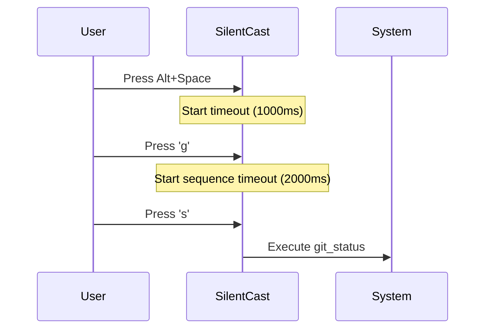

# Spells Guide

Master the art of keyboard magic with SilentCast! This guide covers everything from basic spells to advanced multi-key sequences.

## Understanding SilentCast Spells

SilentCast uses a **prefix-based system** inspired by tools like tmux and Emacs. You activate SilentCast with a prefix key, then cast your spell.

### The Magic Formula

```
[Prefix Key] → [Spell Keys] → [Action Executes]
```

Example: `Alt+Space` → `e` → VS Code opens

## Types of Spells

### 1. Single Key Spells

The simplest and fastest spells:

```yaml
spells:
  e: "editor"      # Alt+Space, E
  t: "terminal"    # Alt+Space, T
  b: "browser"     # Alt+Space, B
  f: "files"       # Alt+Space, F
```

**Best for**: Frequently used applications

### 2. Multi-Key Sequence Spells

VS Code-style sequential spells:

```yaml
spells:
  "g,s": "git_status"      # Alt+Space, G, then S
  "g,p": "git_pull"        # Alt+Space, G, then P
  "d,u": "docker_up"       # Alt+Space, D, then U
  "w,s,l": "web_ssl_local" # Alt+Space, W, then S, then L
```

**Best for**: Grouping related commands

### 3. Modified Keys

Combine with modifier keys:

```yaml
spells:
  "shift+e": "editor_admin"     # Alt+Space, Shift+E
  "ctrl+t": "terminal_elevated" # Alt+Space, Ctrl+T
```

**Note**: Modifier keys only work with single keys, not sequences

## Key Naming Reference

### Standard Keys

| Key | Name in Config | Notes |
|-----|----------------|-------|
| Letters | `a`-`z` | Case insensitive |
| Numbers | `0`-`9` | Top row numbers |
| Space | `space` | Spacebar |
| Enter | `enter` or `return` | Return key |
| Tab | `tab` | Tab key |
| Escape | `esc` or `escape` | Escape key |
| Backspace | `backspace` | Backspace key |
| Delete | `delete` | Delete key |

### Function Keys

```yaml
spells:
  f1: "help"
  f2: "rename"
  f5: "refresh"
  f12: "dev_tools"
```

### Arrow Keys

```yaml
spells:
  up: "volume_up"
  down: "volume_down"
  left: "prev_track"
  right: "next_track"
```

### Special Keys

| Key | Config Name | Platform Notes |
|-----|-------------|----------------|
| ⌘ Command | `cmd` or `meta` | macOS only |
| ⊞ Windows | `win` or `meta` | Windows only |
| Control | `ctrl` | All platforms |
| Alt/Option | `alt` | All platforms |
| Shift | `shift` | All platforms |

### Platform-Specific Keys

::: code-group

```yaml [macOS]
spells:
  "cmd+space": "spotlight_replacement"
  "cmd+shift+4": "better_screenshot"
  "fn": "function_key_action"
```

```yaml [Windows]
spells:
  "win+x": "power_menu_enhanced"
  "printscreen": "screenshot_tool"
  "pause": "system_info"
```
  "menu": "context_menu" # Menu/Application key
```

:::

## Advanced Shortcut Patterns

### 1. Hierarchical Commands

Organize shortcuts in a tree-like structure:

```yaml
spells:
  # Git commands
  "g,s": "git_status"         # git status
  "g,a": "git_add"           # git add
  "g,c": "git_commit"        # git commit
  "g,p": "git_push"          # git push
  "g,p,f": "git_push_force"  # git push --force
  
  # Docker commands
  "d,u": "docker_up"         # docker up
  "d,d": "docker_down"       # docker down
  "d,r": "docker_restart"    # docker restart
  "d,l": "docker_logs"       # docker logs
  "d,p,s": "docker_ps"       # docker ps
  
  # Project navigation
  "p,h": "project_home"      # go to home project
  "p,w": "project_work"      # go to work project
  "p,p": "project_personal"  # go to personal project
```

### 2. Context-Aware Shortcuts

Same key, different contexts:

```yaml
spells:
  # 'e' in different contexts
  e: "editor"                # Just 'e' opens editor
  "g,e": "git_edit"         # In git context, edit commit
  "d,e": "docker_exec"      # In docker context, exec into container
  "p,e": "project_edit"     # In project context, edit project file
```

### 3. Mnemonic Shortcuts

Use memorable patterns:

```yaml
spells:
  # Action-based (verb-noun)
  "o,p": "open_project"      # Open Project
  "o,f": "open_file"         # Open File
  "o,u": "open_url"          # Open URL
  
  # Tool-based
  "v,s": "vscode"           # VScode
  "i,j": "intellij"         # IntelliJ
  "s,t": "sublime_text"     # Sublime Text
  
  # Quick actions
  "q,q": "quick_quit"       # Quick Quit
  "q,s": "quick_save"       # Quick Save
  "q,r": "quick_restart"    # Quick Restart
```

### 4. Number-Based Navigation

Use numbers for quick selection:

```yaml
spells:
  # Quick app switching
  "1": "app_1_browser"
  "2": "app_2_editor"
  "3": "app_3_terminal"
  "4": "app_4_slack"
  
  # Project switching
  "p,1": "project_main"
  "p,2": "project_secondary"
  "p,3": "project_testing"
```

## Timing and Timeouts

### Understanding Timeouts

```yaml
hotkeys:
  # Time to wait after pressing prefix
  timeout: 1000  # 1 second
  
  # Total time for multi-key sequence
  sequence_timeout: 2000  # 2 seconds
```

### Timeout Behavior



### Optimizing for Speed

For faster response:

```yaml
hotkeys:
  # Shorter timeouts for experienced users
  timeout: 500          # 500ms
  sequence_timeout: 1000 # 1 second
  
  # Disable notifications for speed
  show_notification: false
```

## Best Practices

### 1. Choose Intuitive Shortcuts

❌ **Avoid**:
```yaml
spells:
  "x,q,z": "open_editor"  # Random keys
  "a,s,d,f": "git_status" # Too long
```

✅ **Prefer**:
```yaml
spells:
  e: "editor"         # 'e' for editor
  "g,s": "git_status" # 'g' for git, 's' for status
```

### 2. Group Related Commands

```yaml
spells:
  # File operations
  "f,n": "file_new"
  "f,o": "file_open"
  "f,s": "file_save"
  "f,c": "file_close"
  
  # Window management
  "w,n": "window_new"
  "w,c": "window_close"
  "w,m": "window_maximize"
```

### 3. Reserve Single Keys for Most Used

```yaml
spells:
  # Most frequently used (single key)
  e: "editor"
  t: "terminal"
  b: "browser"
  
  # Less frequent (multi-key)
  "s,s": "screenshot"
  "s,r": "screen_record"
```

### 4. Avoid Conflicts

Check for conflicts with:
- OS shortcuts (Alt+Tab, Cmd+Space)
- Application shortcuts
- Other tools you use

### 5. Document Your Shortcuts

```yaml
grimoire:
  complex_deploy:
    type: script
    command: "./deploy.sh --production"
    # Document what this does!
    description: |
      Deploys to production:
      1. Runs tests
      2. Builds assets
      3. Deploys to servers
      4. Notifies team
```

## Common Shortcut Patterns

### Development Workflow

```yaml
spells:
  # Editor
  e: "editor"
  "e,s": "editor_settings"
  "e,p": "editor_plugins"
  
  # Terminal
  t: "terminal"
  "t,s": "terminal_split"
  "t,n": "terminal_new"
  
  # Git
  "g,s": "git_status"
  "g,d": "git_diff"
  "g,a": "git_add_all"
  "g,c": "git_commit"
  "g,p": "git_push"
  "g,l": "git_log"
  
  # Build/Test
  "b,b": "build"
  "b,t": "build_test"
  "b,c": "build_clean"
  "t,r": "test_run"
  "t,w": "test_watch"
```

### System Management

```yaml
spells:
  # Apps
  "a,b": "browser"
  "a,e": "email"
  "a,s": "slack"
  "a,m": "music"
  
  # System
  "s,t": "system_tasks"
  "s,m": "system_monitor"
  "s,p": "system_preferences"
  "s,u": "system_update"
  
  # Quick actions
  "q,l": "quick_lock"
  "q,s": "quick_sleep"
  "q,r": "quick_restart"
```

## Debugging Shortcuts

### Test Your Shortcuts

```bash
# Run in debug mode to see key detection
silentcast --log-level debug

# Test specific shortcut
silentcast --test-shortcut "g,s"
```

### Common Issues

1. **Shortcut not working**
   - Check for typos in configuration
   - Verify the spell name matches grimoire entry
   - Look for OS-level conflicts

2. **Timeout too fast/slow**
   - Adjust `timeout` and `sequence_timeout`
   - Consider user's typing speed

3. **Modifier keys not working**
   - Ensure correct syntax: `"shift+e"` not `"shift,e"`
   - Check platform compatibility

## Examples by Use Case

### For Writers/Bloggers

```yaml
spells:
  # Writing tools
  w: "writer"
  "w,p": "wordpress"
  "w,m": "markdown_editor"
  "w,g": "grammarly"
  
  # Publishing
  "p,p": "publish_post"
  "p,d": "publish_draft"
  "p,s": "publish_schedule"
```

### For DevOps

```yaml
spells:
  # Kubernetes
  "k,p": "kubectl_pods"
  "k,s": "kubectl_services"
  "k,l": "kubectl_logs"
  
  # AWS
  "a,c": "aws_console"
  "a,s": "aws_s3"
  "a,e": "aws_ec2"
  
  # Monitoring
  "m,g": "grafana"
  "m,p": "prometheus"
  "m,d": "datadog"
```

### For Designers

```yaml
spells:
  # Design tools
  p: "photoshop"
  i: "illustrator"
  f: "figma"
  s: "sketch"
  
  # Asset management
  "a,e": "export_assets"
  "a,o": "optimize_images"
  "a,u": "upload_designs"
```

## Next Steps

Now that you're a shortcut wizard:

1. [Configure Grimoire](grimoire.md) - Define what your spells do
2. [Script Execution](/guide/scripts) - Run complex commands
3. [Platform Features](/guide/platforms) - OS-specific shortcuts
4. [Share Your Spellbook](https://github.com/SphereStacking/silentcast-spellbooks) - Share with the community

<style>
.shortcut-example {
  font-family: monospace;
  background: var(--vp-c-bg-soft);
  padding: 2px 6px;
  border-radius: 3px;
  font-size: 0.9em;
}
</style>