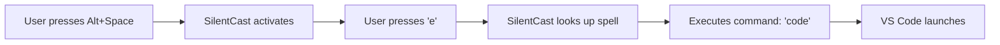

# What is SilentCast?

SilentCast is a silent hotkey-driven task runner designed to boost developer productivity. It allows you to execute tasks, launch applications, and run scripts instantly using customizable keyboard shortcuts - all without interrupting your workflow.

## The Magic Behind SilentCast

Imagine having a magical assistant that responds to your keyboard spells. That's SilentCast. Press your prefix key (like `Alt+Space`), cast a spell (press `e`), and watch your editor appear instantly. No mouse clicking, no app switching, just pure keyboard magic.

💡 **Fun Fact**: SilentCast uses a magical theme throughout - your shortcuts are "spells", your configuration is a "spellbook", and your commands are stored in a "grimoire". Because who said developer tools can't be fun?

## Core Features

### 🎯 Global Hotkeys
SilentCast works system-wide, meaning you don't need to focus on any particular window. Your shortcuts are always ready, whether you're coding, browsing, or in a terminal.

### ⚡ Blazing Fast Performance
- **Memory**: ~15MB idle
- **CPU**: <1% when idle
- **Response**: <50ms hotkey detection
- **Startup**: <1 second

### 🎨 Intuitive Key Sequences
Inspired by VS Code, SilentCast supports both single-key and multi-key sequences:
- `Alt+Space, e` → Open editor
- `Alt+Space, g, s` → Git status
- `Alt+Space, d, c` → Docker compose up

### 🔄 Live Configuration Reload
Change your spellbook (configuration file) and SilentCast automatically reloads. No restarts needed.

## How It Works

1. **Activation**: Press your prefix key (e.g., `Alt+Space`)
2. **Spell Casting**: Type your shortcut (e.g., `e` for editor)
3. **Execution**: SilentCast runs the associated command
4. **Result**: Your application launches or script runs

## Use Cases

### For Developers
- Launch your IDE with a keystroke
- Run build scripts without switching to terminal
- Quick git operations (status, pull, push)
- Start/stop development servers
- Open project documentation

### For DevOps
- SSH into servers
- Docker container management
- Kubernetes operations
- Log viewing and monitoring
- Infrastructure automation

### For Power Users
- Quick application switching
- System utility shortcuts
- File management operations
- Custom script execution
- Workflow automation

## Why Choose SilentCast?

### vs. Traditional Launchers
| Feature | SilentCast | Traditional Launchers |
|---------|------------|---------------------|
| Resource Usage | ~15MB | 100MB+ |
| Configuration | Simple YAML | Complex GUI |
| Scriptable | ✅ Native | ❌ Limited |
| Cross-platform | ✅ Full | ⚠️ Varies |
| Developer Focus | ✅ Primary | ❌ General |

### vs. Shell Aliases
- **Global Access**: Works outside terminal
- **Visual Feedback**: System tray integration
- **Multi-key Sequences**: More intuitive combinations
- **Platform Agnostic**: Same config across OS

### vs. OS Shortcuts
- **Portable Configuration**: Take your shortcuts anywhere
- **Advanced Sequences**: Multi-key combinations
- **Conditional Logic**: Platform-specific overrides
- **Version Control**: Track changes in git

## Philosophy

SilentCast follows these principles:

1. **Minimal Intrusion**: Runs silently in the background
2. **Developer First**: Built by developers, for developers
3. **Configuration as Code**: YAML-based, version-controllable
4. **Cross-Platform**: Write once, use everywhere
5. **Performance Matters**: Every millisecond counts

## Performance {#performance}

| Metric | SilentCast |
|--------|------------|
| Memory (Idle) | ~15MB |
| CPU (Idle) | <1% |
| Startup Time | <1s |
| Hotkey Response | <50ms |
| Config Reload | <0.5s |

## Getting Started

Here's how to get started:

1. [Install SilentCast](/guide/installation) - Choose your platform
2. [Quick Start Guide](/guide/getting-started) - 5-minute setup
3. [Configure](/guide/configuration) - Customize shortcuts

[Get Started →](/guide/getting-started){.next-button}

